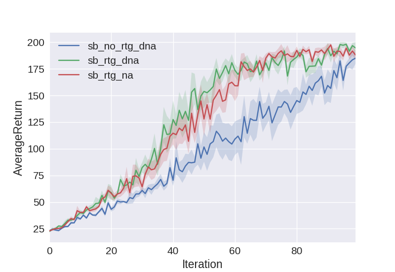
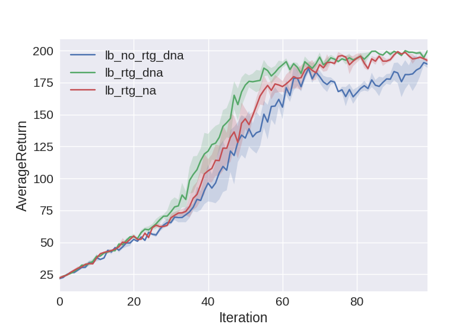
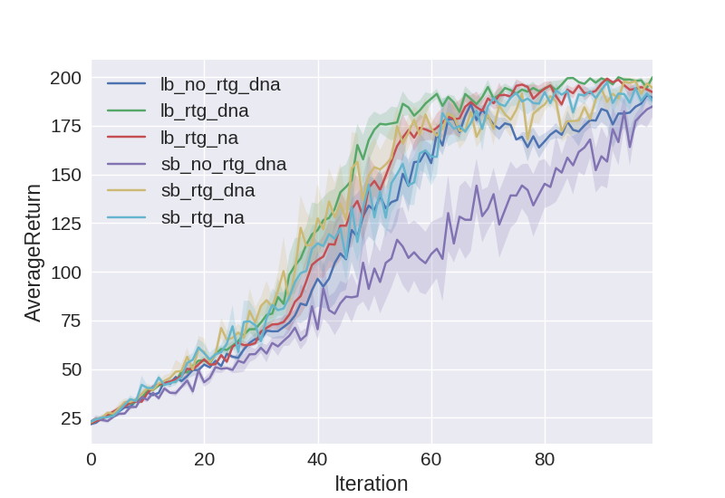
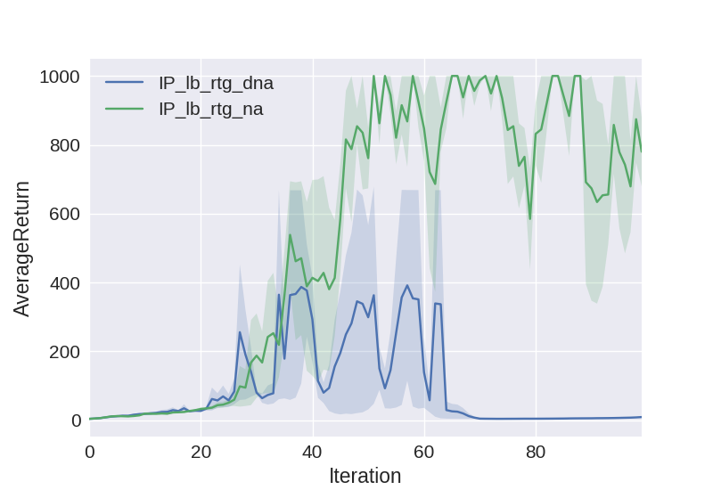
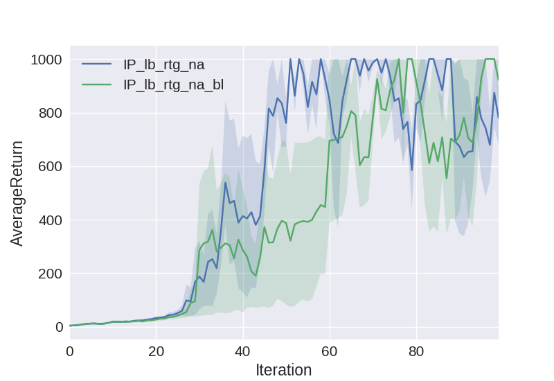
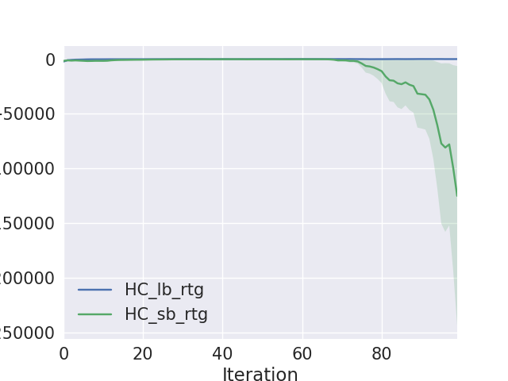
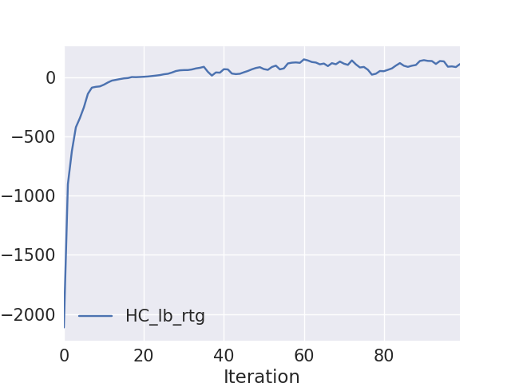
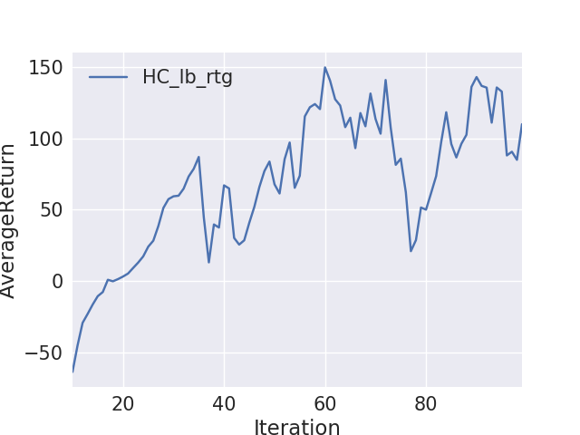

## 1. Problem 1
Run the code
```
$ python train_pg.py CartPole-v0 -n 100 -b 1000 -e 5 -dna --exp_name sb_no_rtg_dna
$ python train_pg.py CartPole-v0 -n 100 -b 1000 -e 5 -rtg -dna --exp_name sb_rtg_dna
$ python train_pg.py CartPole-v0 -n 100 -b 1000 -e 5 -rtg --exp_name sb_rtg_na
$ python train_pg.py CartPole-v0 -n 100 -b 5000 -e 5 -dna --exp_name lb_no_rtg_dna
$ python train_pg.py CartPole-v0 -n 100 -b 5000 -e 5 -rtg -dna --exp_name lb_rtg_dna
$ python train_pg.py CartPole-v0 -n 100 -b 5000 -e 5 -rtg --exp_name lb_rtg_na
```

* In the first graph, compare the learning curves (average return at each iteration) for the experiments prefixed with sb_. (The small batch experiments.)



* In the second graph, compare the learning curves for the experiments prefixed with lb_. (The large batch experiments.)


* Plot all the curve together.


* Answer the following questions briefly:
   
   * Which gradient estimator has better performance without advantage-centering, the trajectory-centric one, or the one using reward-to-go?
      * reward-to-go is better 
   
   * Did advantage centering help?
      * seems not that helpful
   
   * Describe what you expected from the math—do the empirical results match the theory?
      * large batch helps, more samples helps reduce the variance
   
   * Did the batch size make an impact?
      * Yes, larger is better

## 2. Problem 2
Run experiments in the InvertedPendulum-v1 continuous control environment and
find hyperparameter settings (network architecture, learning rate, batch size, reward-
to-go, advantage centering, etc.) that allow you to solve the task. Try to find the
smallest possible batch size that succeeds.
Note: Which gradient estimator should you use, based on your experiments in the
previous section?

Run commands
```
$ python train_pg.py --env_name=InvertedPendulum-v1 -n 100 -b 2500 -e 3 -rtg -dna -lr 0.05 --exp_name IP_lb_rtg_dna 
$ python train_pg.py --env_name=InvertedPendulum-v1 -n 100 -b 2500 -e 3 -rtg -lr 0.05 --exp_name IP_lb_rtg_na
```

* Plot the figure of above two commands. Use Adam algorithm. Note that in this continuous control environment, advantage centering helps a lot.



## 3. Problem 3
For the inverted pendulum task, compare the learning curve with both the neural
network baseline function and advantage normalization to the learning curve without
the neural network baseline but with advantage normalization.

Run command
```
$ python train_pg.py --env_name=InvertedPendulum-v1 -n 100 -b 2500 -e 3 -rtg -bl -lr 0.05 --exp_name IP_lb_rtg_na_bl
```


## 4. Problem 4
For this section, you will use your policy gradient implementation to solve a much more
challenging task: HalfCheetah-v1. Find any settings which result in the agent attaining an average score of 150 or more at the end of 100 iterations, and provide a learning curve.

Run commands
```
$ python train_pg.py --env_name=HalfCheetah-v1 -ep 150 --discount 0.9 -n 100 -b 50000 -e 1 -rtg --exp_name HC_lb_rtg -lr 0.05
$ python train_pg.py --env_name=HalfCheetah-v1 -ep 150 --discount 0.9 -n 100 -b 2500 -e 1 -rtg --exp_name HC_sb_rtg -lr 0.05
```

* In this case, small batch size compared to large one is very unstable, which has larger variance.



* Zoom in. The best average return under this setting is above 100

