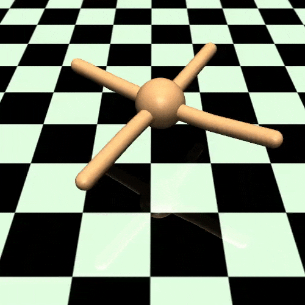
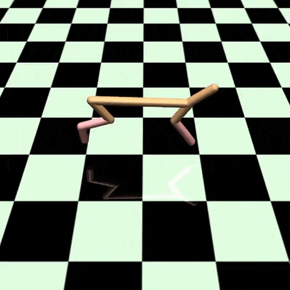
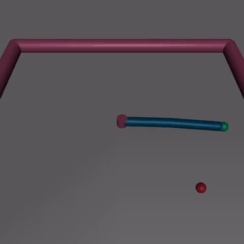
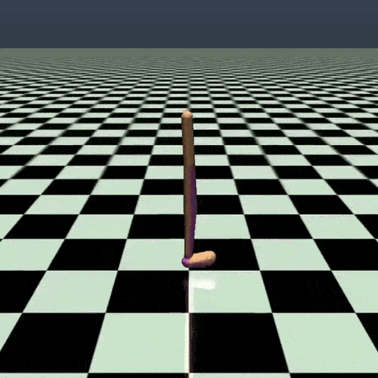

Deep Reinforcement Learning (Fall 2017)
======================================

This course is taught by Prof. Sergey Levine from [University of California, Berkeley](http://berkeley.edu/). 

My repo is fork from [berkeleydeeprlcourse/homework](https://github.com/berkeleydeeprlcourse/homework) and the homeworks were done after taking the [video courses online](http://rll.berkeley.edu/deeprlcourse/).

* HW1: Imitation Learning
* HW2: Policy Gradients
* HW3: DQN
* HW4: Model Based RL

## Environments (MuJoCo)
 

