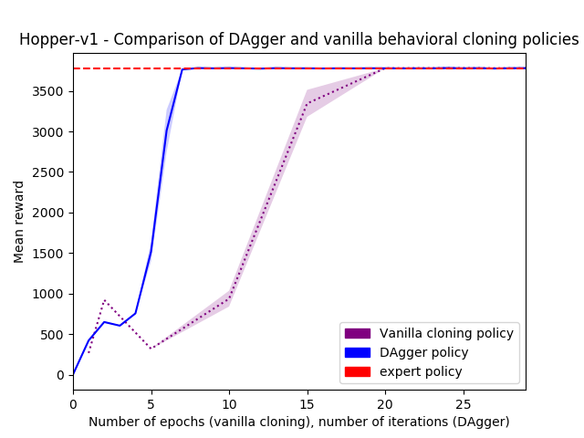

Deep Reinforcement Learning (Fall 2017)
======================================

[The Deep RL CS294 Course](http://rll.berkeley.edu/deeprlcourse/) by the [University of California, Berkeley](http://berkeley.edu/) .

## Environments
We will play with MuJoCo


### HW1: Behavioral Cloning and DAgger
```
$ python run_BC.py --grid
$ python run_DAgger.py 
```
##### vanilla behavioral cloning
###### Succesful example
On task Hopper-v1, the behavioral
  Hopper-v1      |      expert |   imitation
-----------------|-------------|------------                 
mean reward      |  3779.344349| 3776.911487
std reward       |     3.122555| 3.245903
##### DAgger
Result, presented for task `Hopper-v1` for which the DAgger policy outperforms vanilla.

